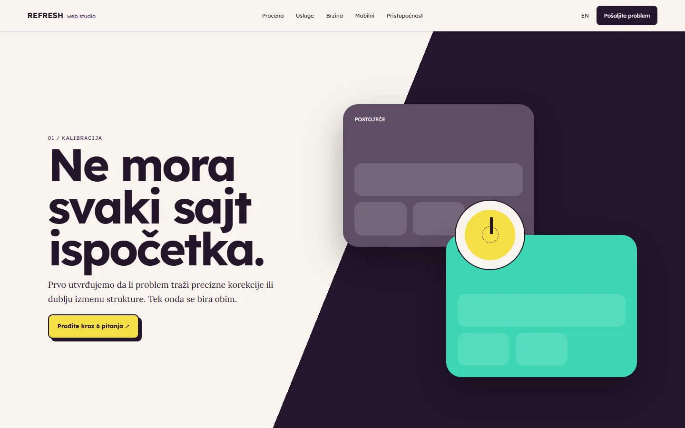
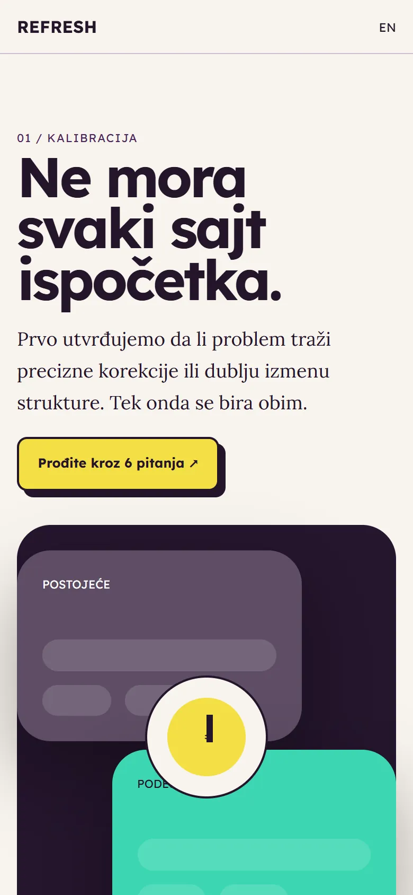
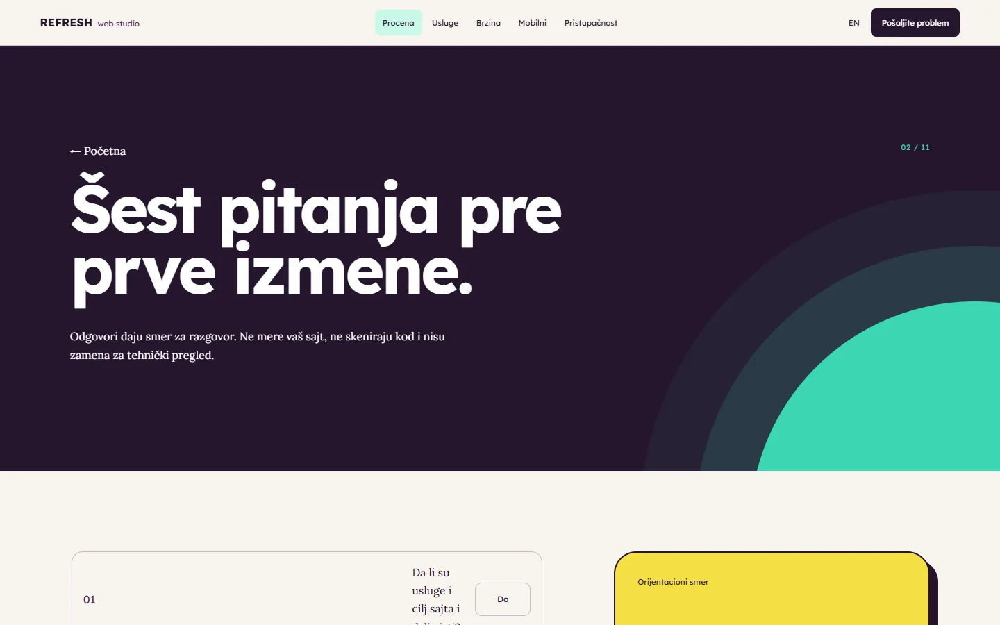

# Web Refresh Studio

A site for small, targeted fixes to an existing website, with a six-question assessment that separates a refresh from a redesign.

**[webrefreshstudio.com](https://webrefreshstudio.com/)** · [Case study (in Serbian)](https://svilenkovic.rs/radovi/web-refresh-studio) · [Srpski](README.sr.md)

> [!NOTE]
> My own project, not client work. The source code is private. This page describes what the site does and how it is built.

<table>
  <tr><td><b>Client</b></td><td>Own project</td></tr>
  <tr><td><b>Industry</b></td><td>Targeted fixes to existing websites</td></tr>
  <tr><td><b>Location</b></td><td>Serbia</td></tr>
  <tr><td><b>Type</b></td><td>Multi-page website</td></tr>
  <tr><td><b>My role</b></td><td>Research, design, development, SEO and hosting</td></tr>
  <tr><td><b>Stack</b></td><td>Astro 7, TypeScript, PHP 8.3, SQLite, nginx</td></tr>
</table>

## About the project

Not every problem calls for a redesign. Sometimes the price list needs fixing on a phone, an image slows the page down or a button cannot be used with a keyboard. Web Refresh Studio helps set the scope before the first change.

A kinetic composition nudges small, visible parts of the interface, which fits the idea of the site: keep what works and fix what causes a real problem. The six-question assessment prepares a conversation about scope; it does not measure the site and it is not an automatic quote. As an example I used Detailing 016, where the key change was a price list by vehicle class that reads well on a phone.

## What I built

- A six-question assessment that separates a small fix from a structural change
- Pages on phone layouts, speed and accessibility
- A case study of the Detailing 016 mobile price list
- Natural scrolling on phones and no movement with reduced motion
- Scope based on issues found on the site, without a generic package

## Results

| | Performance | Accessibility | Best practices | SEO |
| :-- | :-: | :-: | :-: | :-: |
| Mobile | 100 | 100 | 100 | 100 |
| Desktop | 100 | 100 | 100 | 100 |

PageSpeed Insights, lab test of the live site, October 2026. Security headers: 6 of 6. axe accessibility check: no violations. Structured data: `Organization`, `Person`.

## Screenshots

<table>
  <tr>
    <td width="68%" valign="top"></td>
    <td width="32%" valign="top"></td>
  </tr>
</table>

Six questions before the first change

---

Built by [D. Svilenković](https://svilenkovic.com).
